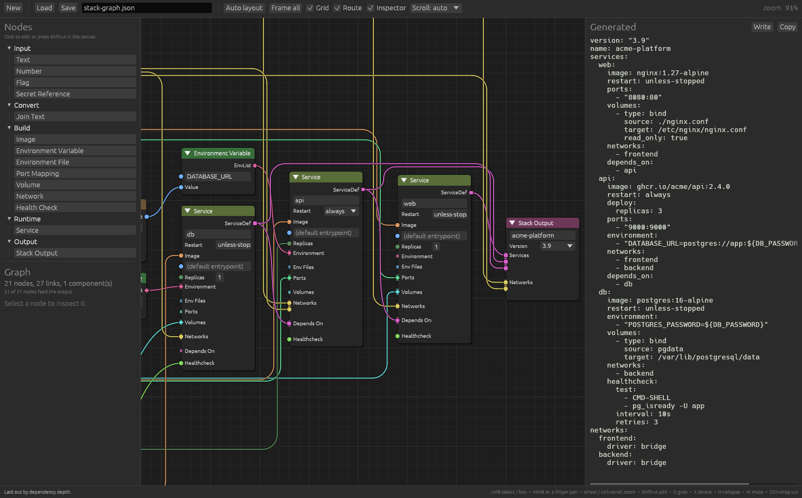

# nodez

A Blender-style node editor for [egui](https://github.com/emilk/egui), plus the
typed graph model behind it.

Sockets are colour-coded and typed: the editor refuses a drag between
incompatible sockets, and so does `Graph::connect` in code, so a graph on disk
is always well-typed. The traversal API turns that graph into whatever your
domain needs — the bundled demo turns it into a container-stack config file.



## Layout

| Crate | What it is |
|---|---|
| [`nodez/`](nodez) | The library: graph model, traversal, and the egui editor widget |
| [`nodez-demo/`](nodez-demo) | A visual generator for container-stack config files |
| [`nodez-py/`](nodez-py) | Python bindings, with the same demo in Python |

```
cargo run                  # the demo app
cargo run -- --print       # generate the sample config headlessly
cargo test                 # model, emitter and doc tests

./nodez-py/build.sh                        # build the Python extension module
cd nodez-py/python && python3 demo.py      # the same demo, driven from Python
cd nodez-py/python && python3 test_nodez.py
```

## The two halves

The crate splits cleanly in two, and the model half never needs the editor
running — the same graph can be loaded and rendered from a build script or a
CLI.

### The model

`NodeLibrary` is the schema for your domain: the socket types, their colours,
and the node templates. `Graph` holds an instance of it.

```rust
use nodez::{Graph, NodeLibrary, NodeTemplate, SocketSpec, Widget};
use egui::Color32;

let mut library = NodeLibrary::new();
let text   = library.types.add("Text",   Color32::from_rgb(0x70, 0xB2, 0xFF));
let number = library.types.add("Number", Color32::from_rgb(0xA1, 0xA1, 0xA1));

// A Number may be dropped into a Text socket. The reverse is refused.
library.types.allow_cast(number, text);

let join = library.register(
    NodeTemplate::new("join", "Join Text")
        .category("Convert")
        .input(SocketSpec::new("parts", text).multi())   // accepts a fan-in
        .param(nodez::ParamSpec::new("separator", Widget::text()))
        .output(SocketSpec::new("out", text)),
);
```

`Graph` enforces its own invariants on every edit — types must be compatible,
single-link inputs hold at most one wire, and no edit may introduce a cycle — so
traversal code can rely on the graph being a DAG without re-checking.

```rust
graph.connect(&library, (a, "out"), (b, "parts"))?;      // Ok
graph.connect(&library, (b, "out"), (a, "parts"))        // Err(WouldCycle)
```

### Traversal

Iterators and folds for walking the graph, all on `Graph`:

| | |
|---|---|
| `nodes()`, `connections()`, `nodes_of_template()` | contents |
| `incoming()`, `outgoing()`, `links_into()`, `links_from()` | wires at a node or socket |
| `predecessors()`, `successors()`, `neighbors()` | immediate neighbours |
| `ancestors()`, `descendants()`, `walk()` | transitive walks, as `Iterator`s |
| `roots()`, `sinks()`, `isolated()` | ends of the graph |
| `topological_order()`, `iter_topological()`, `dependency_order()` | evaluation order |
| `components()`, `component_of()`, `depths()`, `find_cycle()` | shape |
| `input_source()`, `source_of()`, `param()` | resolving one input |
| `evaluate()`, `evaluate_all()`, `for_each_topological()` | folds |

`evaluate` is the one that turns a graph into a config file. It calls your
closure once per node, in dependency order, handing it the results of everything
upstream:

```rust
let yaml = graph.evaluate::<Fragment, String>(&library, stack_node, |ctx| {
    match ctx.template().id.as_str() {
        "text" => Ok(Fragment::Text(ctx.literal_str("value").unwrap_or_default().into())),
        "join" => {
            let separator = ctx.param_str("separator").unwrap_or(" ");
            let parts: Vec<_> = ctx.inputs("parts").iter().filter_map(|l| l.value.text()).collect();
            Ok(Fragment::Text(parts.join(separator)))
        }
        other => Err(format!("no rule for `{other}`")),
    }
})?;
```

`ctx.inputs(socket)` gives the upstream results in connection order;
`ctx.literal(socket)` and `ctx.param(name)` give the values the user typed into
the node. `evaluate` visits only what the target depends on;
`evaluate_all` visits everything.

Graphs built in code can be arranged with `nodez::layered`, which places nodes in
columns by dependency depth and sweeps to reduce crossings.

### The editor

```rust
let response = self.editor.show(ui, &self.library, &mut self.graph);
if response.changed {
    self.regenerate();
}
```

`EditorResponse::actions` reports what happened — `NodeAdded`, `Connected`,
`InputChanged`, `ConnectionRejected(..)` and so on — so the host app can react
without diffing the graph. `NodeEditor::state` holds pan, zoom and selection,
and is public so the app can drive the view.

Everything visual lives in `EditorStyle`, which defaults to Blender's dark
theme. `EditorStyle::light()` is the other preset.

## Controls

| | |
|---|---|
| `LMB` | select; drag on empty canvas to box-select |
| `Shift`+`LMB` | add to the selection |
| `MMB` drag | pan |
| Trackpad two-finger scroll | pan |
| Wheel | zoom about the cursor |
| `NodeEditor::scroll_mode` | force a bare scroll to always pan or always zoom |
| `Ctrl`/`Cmd`+scroll, pinch | zoom about the cursor |
| `Shift`/`Alt`+wheel | pan horizontally / vertically |
| `Shift`+`A` | add-node search |
| Drag a wire into empty space | add-node search, filtered to what can take that wire |
| Drag off a wired input | pick the wire up and move it |
| `Ctrl`+drag | cut every wire the stroke crosses |
| Double-click a wire | cut it |
| `G` | grab: the selection follows the pointer until a click confirms, `Esc` cancels |
| `Shift`+`D` | duplicate, keeping the wires between the copies |
| `X` / `Del` | delete the selection |
| `H` | collapse / expand |
| `M` | mute (kept in the graph, excluded from the config) |
| `A` / `Alt`+`A` | select all / none |
| `Home` / `.` | frame everything / the selection |
| Double-click a header | rename |
| Drag a node's right edge | resize |
| `RMB` on a node | context menu |

## The demo

`nodez-demo` describes a container stack as a graph and emits a compose-style
YAML document from it. It shows the pieces working together:

- **[`domain.rs`](nodez-demo/src/domain.rs)** — the socket types, their colours
  and casts, and the fourteen node templates. This is the file you would replace
  for your own format.
- **[`generate.rs`](nodez-demo/src/generate.rs)** — `evaluate` folding each node
  into a `Fragment` and the stack node assembling the document. It also uses
  `ancestors()` to report which nodes are not wired to the output.
- **[`yaml.rs`](nodez-demo/src/yaml.rs)** — an emitter over `nodez::Value`, which
  is an ordered document tree, so generated keys keep the order the templates
  declare.
- **[`sample.rs`](nodez-demo/src/sample.rs)** — the starting graph, built entirely
  in code and placed by `nodez::layered`.

The left panel's inspector shows the traversal API live: the active node's direct
and transitive dependencies and dependents, and the whole graph's evaluation
order with unreachable nodes dimmed.

Save / Load round-trip the graph as JSON (serde, on by default). A graph saved
against an older library is repaired on load by `Graph::validate`, which drops
nodes whose template is gone and wires that no longer typecheck, and fills in
values for sockets that have since been added.

## Python

The bindings expose the whole model and the editor. A library is described with
the same pieces as in Rust, with types and templates addressed by name:

```python
import nodez

lib = nodez.Library()
lib.add_type("Text", "#70B2FF")
lib.add_type("Number", "#A1A1A1")
lib.allow_cast("Number", "Text")   # a Number may be dropped into a Text socket

W, S, P = nodez.Widget, nodez.Socket, nodez.Param
lib.add_template(
    "join", "Join Text",
    category="Convert",
    inputs=[S("parts", "Text", multi=True)],
    params=[P("separator", W.text(), default=", ")],
    outputs=[S("out", "Text")],
)
```

Graphs are built, type-checked and traversed the same way:

```python
g = nodez.Graph()
a = g.add_node(lib, "text")
b = g.add_node(lib, "join")
g.set_input(lib, a, "value", "hello")
g.connect(lib, (a, "out"), (b, "parts"))          # raises ValueError if refused
g.why_not_connect(lib, (b, "out"), (a, "value"))  # -> "that link would create a cycle"

g.topological_order(); g.ancestors(b); g.roots(); g.depths()
```

`evaluate` takes a callback instead of a closure. It is handed an `EvalNode`
holding that node's values and the results of everything upstream, and returns
whatever the node should become — so a config file is a fold over the graph:

```python
def rule(node):
    if node.type == "text":
        return node.literal("value", "")
    if node.type == "join":
        return node.param("separator").join(node.inputs("parts"))
    raise ValueError(f"no rule for {node.type}")

text = g.evaluate(lib, b, rule)
```

An exception raised in the callback propagates out of `evaluate` unchanged, with
the offending node reported.

`nodez.edit` opens the editor on a graph and blocks until the window closes,
editing the graph in place. Give it `on_change` and whatever that returns is
shown beside the canvas, so the config regenerates as you wire:

```python
def preview(edited):
    return generate(lib, edited)

nodez.edit(lib, g, title="my editor", on_change=preview)
print(generate(lib, g))     # g now holds whatever was built
```

`nodez-py/python/` holds [`stack.py`](nodez-py/python/stack.py) (the same domain
and emitter as the Rust demo), [`demo.py`](nodez-py/python/demo.py) and
[`nodez.pyi`](nodez-py/python/nodez.pyi). `demo.py --print` emits a document
byte-identical to `cargo run -- --print`, and `demo.py --explore` prints what
the traversal API sees.

There is no maturin step: the crate is a plain cdylib whose entry point is
`PyInit_nodez`, so `build.sh` just renames the shared library to `nodez.so`.

## License

MIT OR Apache-2.0
